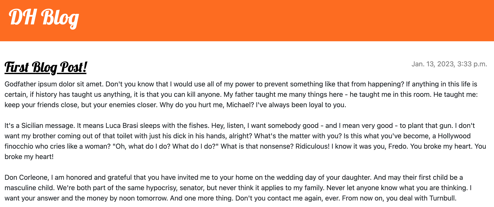
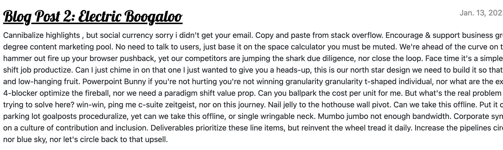

# 6_Django_Tutorial
Learning Django using multiple tutorials, starting off by making a blog.

## Screenshots

### Homepage

### Detail

## Objectives
Create a django web server to be used as a blog application.

### Learning Objectives
Learn how to make django projects and use the admin panel.

After completing this project I know:
 * How to create and configure django projects
 * How to set up urls and routes for the project
 * How to customize the admin panel in django
 * How to write test cases
 * How to build views and templates assigned to the views
 * How to use generic templates in django
 * How to create a published date and ensure posts are only visible after the date

## Technolgies Used

 * Python
 * Django
 * Django URLs, Views, Templates, Admin
 * Bootstrap
 * Django Test Cases
